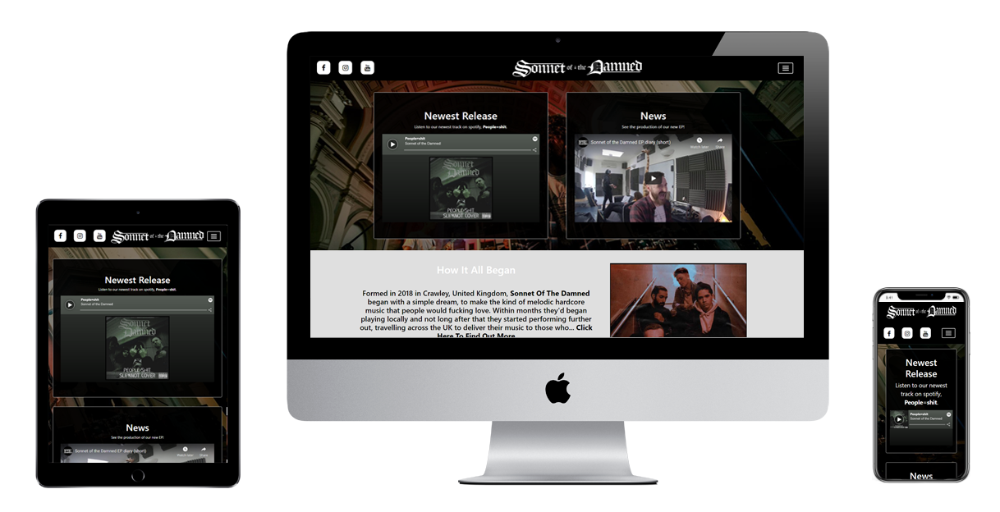

# Sonnet Of The Damned Band Website

## Project Goal
Time to change the music you listen to, time for Sonnet of the Damned. A melodic hardcore band from the south of england,
Sonnet are a fantastic band who are growing by the day. This website will give you all the info you could want or need as
a current or soon-to-be fan of the band in an easy and well defined way. The website is made individual by matching the 
bands colour schemes, providing links to their content and merchandise and giving information about their news and the band 
members.

People don't like to work to find new music so it was very important that the information was clearly divided and easy
to find about any specific subject.

Thank you for coming to look at my project and if you want to know anything about the development process feel free to
reach out to me through my github. Thanks!

---
#

## Links to Relevant Articles
* [User Experience/UX](#user-experience)
    * [User Goals](#user-goals)
    * [User Stories](#user-stories)
    * [Site Owners Goals](#site-owners-goals)
    * [User Requirements](#user-requirements)
    * [User Expectations](#user-expectations)
    * [Design](#design)
        * [Structure And Layout](#structure-and-layout)
        * [Colors](#colors)
        * [Font Choices](#font-choices)
        * [Icons](#icons)
* [Wireframes](#wireframes)
* [Features](#features)
    * [Existing Features](#existing-features)
    * [Potential Future Features](#potential-future-features)
* [Technologies Used in Development](#technologies-used-in-development)
    * [Languages](#languages)
    * [Tools and Libraries](#tools-and-libraries)
* [Testing](#testing)
* [Deployment](#deployment)
* [Credits](#credits)

---

## **User Experience**

### **User Goals**

The user goals for the site are...
* A website that works well on desktop, mobile and tablet.
* A website that looks good in all places.
* A website that fits with the existing band identity so a fan would want to use it.
* A website that allows easy access to the bands current social medias.
* A website that can easily direct towards merchandise for fans.
* A website that allows a user to get straight to the information they want to see without wading through information they don't want.
* A website that gives information about current tour dates.
* A website that gives up to date and relevant news about the band.
* A website that lets the user find out more about the band and its members easily.

[Back to Table of Contents](#links-to-relevant-articles)

### **User Stories**

As a user, I want...
* To be easily able to go to the bands social medias.
* To see images of the band and its members.
* To be able to find out whats happening with the band.
* To see and hear their music on the website.
* To be able to buy the bands merch if I like their music.
* To be able to find out about the history of the band.
* To find out when the band are playing shows near me.
* To be able to use the website on my phone.
* To have different sections of information clearly divided so I can find things.
* To know whether the band make music I like so I can make my decision quickly whether to stay or go.
* To be able to get right to the information I want without wading through info I don't care about.
* To be convinced that the band are exciting and good.
* To know that any outside link I click (i.e. social media) will open in a different tab so it doesn't interrupt my browsing experience.
* It to be obvious that I'm on the right website and in the right location.

[Back to Table of Contents](#links-to-relevant-articles)

### **Site Owners Goals**

As a site owner, I want a site that...
* Makes it easy to sell merchandise and increases merch sales.
* Interacts well with our social medias and increases listener numbers.
* Makes us look better than other competing bands.
* Lets us easily say when we're playing shows to increase ticket sales.
* Talks about who we are to make people become more interested in us and attract new fans.

[Back to Table of Contents](#links-to-relevant-articles)

### **User Requirements**

As a user, I require...
* A site that is easy to navigate through the use of the navbar.
* Contains relevant content to the band.
* Looks good and makes sense relevant to the bands aesthetics.
* Nothing to provide any error messages and the band info to be clear. 
* A site that works on mobile and tablet as well as desktop.

[Back to Table of Contents](#links-to-relevant-articles)

#### **User Expectations**

As a user, I expect...
* All information on bands show to tell me when and where they're performing.
* Any external link (like social media or merchandise) I click to open in a new tab.
* Has an easy way to purchase merchandise.
* to see what the merchandise looks like before I click on it.

[Back to Table of Contents](#links-to-relevant-articles)

### **Design**

#### Structure And Layout
I've decided to use [Bootstrap](https://getbootstrap.com/) for the overall structure and layout of my website as its
pre-included CSS and javascript elements make it much easier to keep a similar design from one page to another, has
a great mobile first layout that will adapt very well as well as my belief that I can make use of the jumbotron function 
to easily achieve the rectangle and squares based layout I designed in my wireframes.

[Back to Table of Contents](#links-to-relevant-articles)

#### Colors
As the band already had a logo and had made use of primarily black and white on their social medias, I decided it made
sense to stay in that general area for the rest of the website design as well. I looked at [ColorSpace](https://mycolor.space/)
and [Adobe Color Wheel](https://color.adobe.com/create/color-wheel) but just couldn't find anything I liked more than my 
original black and off-white design. 

* RGB(0,0,0): Pure and complete black. This opposes their logo (which is RGB(255,255,255)) perfectly so I decided that simple was best and stuck with it.
* RGB(223,223,223): An off-white greyish colour. I decided this was better than going with pure white like I originally planned because it makes the site less harsh
on the eyes.

It's not a very complicated design but it has great contrast, is easily readable and makes it easy to make the non-white elements of the site stand out.

[Back to Table of Contents](#links-to-relevant-articles)

#### Font Choices
For my websites fonts, I made use of [Google Fonts](https://fonts.google.com/) to find what was available to me. I didn't need 
anything for the heading as was making use of the bands logo, so wanted to find something to stand out in other places and 
eventually settled on using Russo One for the navbar, as it was adventurous, and would likely get annoying if used for whole
paragraphs, but worked perfectly for 5 large single word links and a sub-header on each page. 

As a backup for Russo One I used sans-serif as its extremely readable and very reliable, and decided to make use of that for 
the rest of the text on the website for the exact same reasons. 

[Back to Table of Contents](#links-to-relevant-articles)

#### Icons
To compliment the fonts, I decided to make use of icons for my social medias links, and realised very quickly that 
[Font Awesome](https://fontawesome.com/) would be the best way to do it. With three simple searches I was able to find the
right icons for my social medias, and were easily styled to fit in with the header bar around it and to match the band logo
next to (or above if on mobile) it. For the navbar icon I used the bootstrap default one, but made modifications to it as
bootstrap only provides an off-white and off-black one and I wanted a pure white one with a clear border to make it match
the social icons and band logo. 

[Back to Table of Contents](#links-to-relevant-articles)

--- 

## **Wireframes**
I made use of a website called [MockPlus](https://app.mockplus.com) to create the wireframes for my website. I realised
later that there were more efficient and easier tools but stuck with it as I was already half way through and it would
have been more work to switch to something else. 
I made my wireframe for the homepage's desktop version first, then did the same for the other 4 pages of the site, And
then after that made the phone and tablet versions for each. This let me focus on design in the initial stage and then
adapatation afterwards. The website was made to be quick to find what you need through the navbar and each page to be
short and sweet, with the essential information and little more. 

All 15 wireframes are viewable below:

### **Home - index.html**

#### [Desktop](https://github.com/willslater99/Sonnet-Of-The-Damned-Band-Site/blob/main/assets/initial-design/wireframes/sonnet-home-wireframe.png)

#### [Tablet](https://github.com/willslater99/Sonnet-Of-The-Damned-Band-Site/blob/main/assets/initial-design/wireframes/sonnet-home-tablet-wireframe.png)

#### [Mobile](https://github.com/willslater99/Sonnet-Of-The-Damned-Band-Site/blob/main/assets/initial-design/wireframes/sonnet-home-mobile-wireframe.png)

### **News - news.html**

#### [Desktop](https://github.com/willslater99/Sonnet-Of-The-Damned-Band-Site/blob/main/assets/initial-design/wireframes/sonnet-news-wireframe.png)

#### [Tablet](https://github.com/willslater99/Sonnet-Of-The-Damned-Band-Site/blob/main/assets/initial-design/wireframes/sonnet-news-tablet-wireframe.png)

#### [Mobile](https://github.com/willslater99/Sonnet-Of-The-Damned-Band-Site/blob/main/assets/initial-design/wireframes/sonnet-news-mobile-wireframe.png)

### **Tour - tour.html**

#### [Desktop](https://github.com/willslater99/Sonnet-Of-The-Damned-Band-Site/blob/main/assets/initial-design/wireframes/sonnet-tour-wireframe.png)

#### [Tablet](https://github.com/willslater99/Sonnet-Of-The-Damned-Band-Site/blob/main/assets/initial-design/wireframes/sonnet-tour-tablet-wireframe.png)

#### [Mobile](https://github.com/willslater99/Sonnet-Of-The-Damned-Band-Site/blob/main/assets/initial-design/wireframes/sonnet-tour-mobile-wireframe.png)

### **Merch - merch.html**

#### [Desktop](https://github.com/willslater99/Sonnet-Of-The-Damned-Band-Site/blob/main/assets/initial-design/wireframes/sonnet-merch-wireframe.png)

#### [Tablet](https://github.com/willslater99/Sonnet-Of-The-Damned-Band-Site/blob/main/assets/initial-design/wireframes/sonnet-merch-tablet-wireframe.png)

#### [Mobile](https://github.com/willslater99/Sonnet-Of-The-Damned-Band-Site/blob/main/assets/initial-design/wireframes/sonnet-merch-mobile-wireframe.png)

### **About - about.html**

#### [Desktop](https://github.com/willslater99/Sonnet-Of-The-Damned-Band-Site/blob/main/assets/initial-design/wireframes/sonnet-about-wireframe.png)

#### [Tablet](https://github.com/willslater99/Sonnet-Of-The-Damned-Band-Site/blob/main/assets/initial-design/wireframes/sonnet-about-tablet-wireframe.png)

#### [Mobile](https://github.com/willslater99/Sonnet-Of-The-Damned-Band-Site/blob/main/assets/initial-design/wireframes/sonnet-about-mobile-wireframe.png)

[Back to Table of Contents](#links-to-relevant-articles)

--- 

## **Features**

### **Existing Features**

#### Navigation

For navigation I decided to go with a dropdown navbar from a hamburger icon that I used Bootstrap to implement,
choosing to have this appear no matter the platform viewed on instead of just on mobile as some might have, as I 
felt it was better to save space and clean up the visual appearance of the desktop version of the site. I stuck with
website standards on this and affixed the icon to the header bar on the top right, as it appears on many or even 
most websites.

#### Social Medias 

To better integrate with the pre-existing social medias the client has, I decided to use three matching Icons through
[Font Awesome](https://fontawesome.com/) affixed to the top left of the header bar on desktop and tablet to make it
easy for users to find the three main social medias of the client. For the mobile view I changed this a bit to give
a more appealing look, making use of a media query to hide the original icons and place a replica set of icons below
the band logo, giving a better mobile website flow overall.

#### Band Logo Header 

For the website header I choose not to use fonts and to just go directly with the clients pre-existing logo, which
I made into a clickable in-site link that returns to the site homepage no matter the platform, as this is very
standard and has almost come to be expected from modern websites. 

#### Hero Image

I implemented a hero image of the band performing and placed it below the header of the site, then covering it with
a partially transparent grey cover, to give a darker effect to the image overall and make it blend in better with the
websites darker tones as it was originally quite a bright image. I set its width to cover the entire website and its 
height to 70vh, allowing some of the next section below it to show so that someone has the opportunity to see whats
next and potentially get them interested. 

#### News/New Releases Jumbotrons

I made use of Bootstrap's jumbotron feature heavily throughout the site, and it started with two equally spaced 
jumbotrons next to each other. One of these is entitled news and shows a piece of news about the band of the clients
choice, in this case including an embedded youtube video. The other is New Release and is supposed to show the newest
thing out by the client, in this case a cover of theirs, shown through an embedded spotify song. 

#### News Columns

Again using the jumbotron feature, I have created columns that display each a different article of news about the band.
On desktop these appear as three equally spaced long columns next to each other, and on tablet and mobile instead appear
in a stacking fashion, one on top of the other. This differs from my original wireframe for tablet as my original plan 
was just to have the tablet version appear like a smaller version of the desktop, but I realised that it just would have
been too small to be functional and adapted it. 

#### Tour Dates

The website provides tour dates for the band, stating the city, venue and date they are performing. On desktop and tablet
this appears as two large boxed columns next to each other (again using jumbotrons) and on mobile instead appears as one
longer scrolling boxed column. This provides a readable view on all platforms and makes good use of the space without
being hard to look through or wasting any space.

#### Merchandise

Through the website, you can also see the bands merchandise and use a link to go to the relevant place to buy it. On 
desktop this appears as three boxes next to each other on each row and is in two rows (although it could be as many as
the client wanted, I just kept it simple to start), on tablet it displays as two boxes next to each other in three rows
and on mobile appears as each box taking up the majority of the screen width and appearing one after another in a 
scrolling fashion. This is well designed as it can be as short or long and include as many items as the client likes.

#### About The Band

On the about the band section, I've used a large jumbotron split into three columns (the first two being text and the
last being a picture of the band) as this allows the website to simply shift a third of the site onto the next row to
adapt to smaller screens without much work. On desktop they appear all next to each other, on tablet they appear as two
columns of text and a picture below it and on mobile they just look like two paragraphs and then a picture.

#### About the Band members

For the about the band members section, I've again used jumbotrons to have a jumbotron for each band member, each One
containing a picture and a paragraph of information. On desktop this appears as 4 equally sized and spaced columns next
to each other for the 4 band members, on tablet this appears in rows of two by two and on mobile it appears one below
another in a scrolling fashion, making it perfectly adapatable and easy to use. 

#### Footer

In the footer, I included a small bit of legal info stating it was developed by Will Slater and the year that was done 
so and affixed it to the center left. The most useful feature of the footer though is that it includes smaller versions
of the three social media icons found in the header, so that someone can click to these links without having to scroll
back up to the top of the page. These are affixed to the right hand corner of the footer and do and look the same as the 
top icons, but are just smaller and added purely for user convenience. 

[Back to Table of Contents](#links-to-relevant-articles)

### **Potential Future Features**

#### Payment Systems

In the future I'd like to integrate a payment system. It could have huge potential uses for the merchandise section as 
being able to sell merchandise, albums and show tickets directly from the website could do massive for sales numbers and
overall taking for the client. 

#### Contact form

A contact form could be potentially integrated so that events managers could contact them about booking them for shows and
fans could contact them with questions.

#### Sell tickets

A way to sell tickets to the events listed on the tour section could be great for upping attendance numbers. I didn't look
at this now as the band still don't have presale on alot of their shows, but it could be great as they grow.

#### Google Maps Integration

Being able to click on a specific venue name listed on the tour section and see through either an embedded popup or link 
directly to the google maps site would be great, allowing the user to see exactly where the venue is to make attendance 
easier. 

[Back to Table of Contents](#links-to-relevant-articles)

---

## **Technologies Used In Development**

### **Languages**

* [HTML](https://en.wikipedia.org/wiki/HTML): Hypertext Markup Language, or HTML, is the building blocks of the internet and so the base of all 5 webpages found on the site.
* [CSS](https://en.wikipedia.org/wiki/Cascading_Style_Sheets): Cascading Style Sheets, or CSS, allows us add design, colour and  more to the building blocks created by the HTML.
* [JavaScript](https://en.wikipedia.org/wiki/JavaScript): JavaScript is used for the more complex moving parts of a website. I haven't used any javascript first-hand but it is
                                                          used throughout the site through [Bootstrap's](https://getbootstrap.com/) classes that make use of it automatically.

### **Libraries & Frameworks**

* [Font Awesome](https://fontawesome.com/): Font Awesome allowed me to acquire the icons that I used for my social media links.
* [Bootstrap](https://getbootstrap.com/): Bootstrap is the primary library running the site, allowing my jumbotrons to function and my site to adapt well between tablet and mobile.
* [Google Fonts](https://fonts.google.com/): Google Fonts provided the font Russo One which I've used for my navbar and individual page headings. 

### **Tools**
* [GitHub](https://github.com/): Github is the software hosting site for the project and holds all of my work throughout.
* [GitPod](https://www.gitpod.io/): Gitpod is the programming platform I've made use of as it integrates directly with GitHub. 
* [Mockplus](https://app.mockplus.com/): Mockplus is a wireframe creation tool and is how I made the 15 wireframes I used for the design of my website.
* [W3C HTML Validation Service](https://validator.w3.org/): W3C is an online validator that checks the HTML you feed into it for any syntax errors (i.e unclosed div's, using 
                                                            obselete code, etc) and then tells you what's wrong so you can correct it.
* [W3C CSS Validation Service](https://jigsaw.w3.org/css-validator/): W3C CSS is an online validator that checks the CSS you feed into it for errors to tell you what's wrong so 
                                                                      that you can fix it.
* [Bootstrap Documentation](https://getbootstrap.com/docs/4.5/getting-started/introduction/): Bootstrap's documentation tool allows you to search for anything found in bootstrap
                                                                                              and provides you information about what it is and how it works.
* [Google Images](https://www.google.com/imghp?hl=xx-elmer): Google images is a resource for online images. I used it for the objects in the merch section and checked to make sure
                                                             all the ones I used were royalty free for use. 

[Back to Table of Contents](#links-to-relevant-articles)

---

## **Testing**

### Navigation Bar

* **Plan**    
I want to include a drop-down navigation bar which will be fixed to the top-right, in the header and next to the band logo.  
I want the nav-bar to be in a drop-down form on all devices to save space, and to appear with the links to the five site
pages aligned horizontally on desktop and tablet and instead vertically on mobile. 

* **Implementation**   
I used Bootstrap to implement the nav-bar as this helps to automatically structure it and adapt it better for different
screen sizes. I used CSS to change the colour of the navbars colours, hamburger icon and text to make it fit better with
the site.

* **Test**    
To test the navbar, I have clicked on all of the links to make sure they go to the right pages, then repeated this click
test using chrome developer tools to click them in a mobile and tablet form to make sure that nothing changes it and that
it still works. I also checked it on Edge and Firefox to see if it worked the same on other browsers, which turned out
perfectly. 

* **Result**    
The navbar shows how I want it to on all devices and browsers. It was a little close to the right hand edge on mobile so 
in my mobile media query I increased the margin to get a better result. All links work, it appears how I want it to and
I'm completely happy with it.

### Jumbotrons/Rectangular Dividers
* **Plan**    
I want to have nearly all of the site presented by seperated and aligned rectangles that each contain the bit of info
relevant to the page they're on. 

* **Implementation**    
As I'm not at the necessary skill level with JavaScript to do this in a reasonable time frame, I used Bootstrap's 
jumbotrons to do this as they fit into bootstrap's column system for multi-device implementation nicely and can be 
adjusted very easily. For the most part they fit in well, aligning how I want them to and adapting to different devices
how I predicted and wanted them to. On the occasion that they don't adapt to a device properly, I made use of advice
from a tutor of creating a duplicate set of jumbotrons layed out exactly how I wanted them and then just making use
of CSS to hide this duplicate set when the original ones work and making it appear when I need it to and then hiding
the original. I have all the content within them centered, to make them align well. I also have them all slightly 
transparent through the use of RGBA in CSS so that any hero images and background colours aren't completely covered.  

* **Test**    
I've tested them on multiple devices, screen sizes and browsers and have achieved the intended result on all. Looking 
at them on all pages to make sure they do as intended. No errors found. 

* **Result**    
The jumbotrons appear as intended, look good and provide the isolated information inside them nicely and visibly. I'm
completely happy with my result.

### Social Media Links
* **Plan**    
I want to include three icons to link directly to the clients various social medias. These should appear as in the
top left, inside the header and be aligned with the band logo header text and navbar icon. 

* **Implementation**    
To implement this, I made use of FontAwesome to get the three right icons for my three links. I made an unordered list
with the links to each social media being the three items in the list, then used CSS to stylise the whole thing, making
them appear as 3 squares with the icon in the center, then setting their background color to white and the icon to black,
rounding the corners on them to make them look better and then finally setting for the background and icon color to reverse
when hovered over on desktop. Finally, as I wanted them to appear below the band logo on mobile, I made use of the trick I 
had been taught of duplicating and hiding it, so created a copy of the icons and then placed the come for it after the band
logo and before the navbar, allowing them to appear below the logo but to the left of the navbar on mobile. Then I simply 
hid it on desktop and tablet views and made it appear on mobile, hiding the original one for mobile view to avoid having 
two visible copies. Finally, I duplicated this code and added it onto the bottom of the footer, then gave it a different ID 
and used CSS to change its size and hide it on mobile view, as I realised this would appear better.

* **Test**    
I tested these links by clicking on all three of them on all 5 pages (15 times), then repeating that on tablet and mobile
(45 times) and finally doing the same thing on Edge and Firefox (resulting in me clicking the same three links 135 times).
I viewed them on all platforms to make sure they looked how I wanted them to.

* **Result**    
After all the testing the links came out perfect, the icons look how I want them to and I'm completely happy with the
result that I've achieved. 

[Back to Table of Contents](#links-to-relevant-articles)

---

## **Bug Fixing**

#### Homepage About Text

* **Bug**    
The text wasn't centering no matter what I did, and it looked very bad as it was sticking to the left-hand side of the screen.

* **Fix**        
I realised that everything else was wrapped in a div but that this wasn't, so put the paragraph inside of its own div. This 
worked and where-ever I placed the div the text would center within it when asked, so I just centered the text within the div
then centered the div within its parent element.

* **Verdict**    
Bug was fixed and it now appears as intended. 

#### Dropdown Navbar

* **Bug**    
The navbar hamburger icon was appearing, but not doing anything on merch.html but no other page. 

* **Fix**    
Tried alot of fixes but couldn't figure out what was wrong. I then while looking through my other pages where the navbar 
was working for inspiration noticed that the button elements data-target was pointing to navbarmenu, the correct ID for 
what I was aiming for, but the rest of the pages were specifically stating #navbarmenu. I added the # symbol and it began
working immediately. 

* **Verdict**    
Bug was fixed and the navbar now works in all places. 

#### Jumbotrons

* **Bug**    
On some pages, jumbotrons were going over the side of the screen on mobile and overlapping instead of appearing one
below another.

* **Fix**
I took alot of time trying to solve this and couldn't figure out why I was having problems as Bootstrap is made to 
automatically push elements that don't fit down onto the next row below it. I tried playing with margins, centering,
the number of columns assigned to it in Bootstrap's pre-included classes, but with no result. I then attempted to
change the size of the jumbotrons to make them smaller and see if this helped by switching 'col-md-6' to 'col-sm-6', 
and when I did so, the items were so small that they weren't practical. I then decided to see what would happen if
I increased their designated size and used 'col-xl-6' and this immediately fixed the problem, making them no larger 
than they were as 'col-md-6' but stacking how they should on smaller devices. My best theory as to why this happened
is that Bootstrap thought because the elements had classes stating them as medium, it could fit them next to each 
other even on the smaller screensize, but that once I changed this to state they were extra large, it knew that it
had no chance of fitting it and pushed the second item down to the row below, although I don't understand the tech
enough so this is a guess at best. 

* **Result**   
Bug was fixed and the jumbotrons all resize as intended now. 

#### Galaxy Fold Appearance

* **Bug**    
The site resizes well for convential devices I tested (pixel 2a, iphone X, Ipad, Ipad Pro, etc) but when I tested
it on a Galaxy Fold as presented by Chrome developer tools, it took a completely different form and huge parts of
the site break including multiple sections, the header and the footer. 

* **Fix**    
The reason for the issue is obvious to me. The device has very odd dimensions compared to convential devices, being 
only 280 pixels wide in its 'phone-form'. Because of this, huge amounts of things are being pushed down to the next
row that should appear next to each other and items are appearing too large and covering others. To fix this, I
would need to either create a new media query specifically for this device or go back through and change every
single size value to work in vw or vh, which would be a long process as alot of my device uses pixel values that
change based on media query. 

* **Result**
The bug has not been fixed and I will do so in the next release. I will also try to refrain from pixel values and
make better use of vw/vh values instead in the future on all projects. 

#### Social Icons

* **Bug**    
When viewed on desktop the icons weren't appearing on desktop or tablet but were on mobile.

* **Fix**        
I looked through the css for the classes and ID's attached to the social icons and their links and quickly found
that, as I have duplicate versions of the social icons for different placement on different devices, I had
accidentally set the ID's for them both as 'display: none;' on the main css but had entered them correctly as
'display: none;' and 'display: inline;' on the mobile media query. I corrected the issue and made the original
copies of the icons show, fixing the issue. 

* **Result**    
The issue was fixed and now appears as intended on all primary devices. I'm happy with the result.

[Back to Table of Contents](#links-to-relevant-articles)

---

## **Deployment**

This project was deployed using GitHub by following the steps given below, which must be done after the code
has been written, committed and pushed to GitHub.

1. Log into your GitHub account. 
2. Enter the repository and then go to the **Settings** tab.
3. Scroll down to the 'GitHub pages' section and then the 'Source' piece within it.
4. Select 'Branch: Main' from the dropdown menu and then select the folder of 'Root'.
5. Click 'Save' and then wait a couple minutes and it should be up and working.
6. Now its completely viewable at https://willslater99.github.io/Sonnet-Of-The-Damned-Band-Site/ and any and all commit's and pushes from relevant IDE's (such as GitPod) 
will automatically update it.

If you want to run the project locally:

1. Log into your GitHub account.
2. Click the 'Code' dropdown and then within it, select the HTTPS option and copy the link displayed.
3. Open your IDE and open the Git Terminal. 
4. Set your working directory to the intended directory for the cloned repository.
5. Use the 'git clone' command and paste in the URL copied from before. 
6. Enter and it will create your clone repository. 

[Back to Table of Contents](#links-to-relevant-articles)

---

## **Credits**

I've used two sites for the primary inspiration on how I would build my site. Both rock-band sites for helping align with the standards. 

[Nickelback](https://www.nickelback.com/)

[Evanesence](https://www.evanescence.com/home/)

All of my pictures for the website were taken from the clients social medias except for the merchandise page, where I used [Google Images](https://www.google.com/imghp?hl=xx-elmer)
and looked for royalty free images to use, as these are only made to be temporary fill-ins before they can be replaced with genuine merchandise photos for the band.

The website is for fans of the band and potential fans and is made to serve two seperate purposes. 

1. The first purpose is to help fans of the band with acquiring information on the band that helps the band grow, such as
finding out when they are performing and where and potentially providing the ability to purchase tickets for these shows,
purchasing merchandise and just finding out news about new releases and information about the band as often fans are
willing to spend more money if they feel a personal connection to the performers, so providing information on the bands 
origins and their individual members helps to do this. 

2. The second purpose is to help grow the bands audience by giving potential fans of the band the information they need to
learn more about the band and links to the bands music. Although these links aren't necessary for people who are already
fans, they are critical for newcomers so that they can hear the bands music as easily as possible, potentially become
fans and join the first group spoken about above, allowing the band to become more financially successful. This is why the
merchandise and tour pages require use of the navbar where as the newest release, news and about the band section are able
to be accessed directly from the homepage, optimising the site to provide those who are likely to spend the least time 
looking around with the information we want to convey to them first. 

### HOMEPAGE UX/UI

* The homepage provides short descriptions of news, new releases and about the band so that it encourages the user to click
further and explore more, as if we gave them everything on the homepage they'd have no reason to go any further. This is
why each section has been put onto its own seperate page, as although the website could be achieved by having a single
long homepage with an individual section instead for each piece, it wouldn't encourage the same exploration or allow
people who already know what they want to get there as easily. It doesn't include tour or merchandise to provide a much
more succinct homepage and as this is something only really necessary for those who are already fans, people who won't be
dissuaded by two extra clicks of the hamburger icon and the page name.

* The wireframe for the homepage is linked below (The navbar would be minimised by default and is shown as such on all other
wireframes but has been displayed open on this first wireframe to provide the general idea of its design and how it would
appear on all pages when opened)

[Home-PC-Wireframe](https://github.com/willslater99/Sonnet-Of-The-Damned-Band-Site/blob/main/assets/initial-design/Wireframes/sonnet-home-wireframe.png)

[Home-Mobile-Wireframe](https://github.com/willslater99/Sonnet-Of-The-Damned-Band-Site/blob/main/assets/initial-design/Wireframes/sonnet-home-mobile-wireframe.png)

[Home-Tablet-Wireframe](https://github.com/willslater99/Sonnet-Of-The-Damned-Band-Site/blob/main/assets/initial-design/Wireframes/sonnet-home-tablet-wireframe.png)

### NEWS UX/UI

* The news page provides a purpose to user for finding out about what the band are up to, as fans of artists often want to
know this kind of information and get as involved as possible in the artist. This allows them to find out what the band 
are up to professionally, such as new releases and information that is provided by the artist for marketing reasons (such 
as performing for a charity, etc.) The news page is designed with three sections inside of it so that its easy to keep 
things relevant and current even if there isn't that much new stuff to talk about. These news boxes will have to be filled
with their information manually, although in an ideal world with enough time I would have them organised with the newest 
piece of news on the left and likely use a javascript library to make them automatically shift to the right by one each 
time a new one is added. 

[News-PC-Wireframe](https://github.com/willslater99/Sonnet-Of-The-Damned-Band-Site/blob/main/assets/initial-design/Wireframes/sonnet-news-wireframe.png)

[News-Mobile-Wireframe](https://github.com/willslater99/Sonnet-Of-The-Damned-Band-Site/blob/main/assets/initial-design/Wireframes/sonnet-news-mobile-wireframe.png)

[News-Tablet-Wireframe](https://github.com/willslater99/Sonnet-Of-The-Damned-Band-Site/blob/main/assets/initial-design/Wireframes/sonnet-news-tablet-wireframe.png)

### TOUR UX/UI

* The tour page is designed with two large boxes each containing the dates and locations of performances, each date having a
single line for it with large margins above and below it. It has been structured this way to make it as easy as possible
to find the tour date and location that is most useful for the user, as the tour page unavoidably needs to hold a lot of
information for a band that plays often and in many locations. I feel the two boxes let the information be seperated in an
efficient way while not requiring the user to scroll down for a long time to find what they are looking for. The faster we
can get a nearby tour date infront of someone's eyes, the better, but if we use too many boxes or too small text the shows
will get lost amongst each other and be useless to anyone other than the most determined user. 

[Tour-PC-Wireframe](https://github.com/willslater99/Sonnet-Of-The-Damned-Band-Site/blob/main/assets/initial-design/Wireframes/sonnet-tour-wireframe.png)

[Tour-Mobile-Wireframe](https://github.com/willslater99/Sonnet-Of-The-Damned-Band-Site/blob/main/assets/initial-design/Wireframes/sonnet-tour-mobile-wireframe.png)

[Tour-Tablet-Wireframe](https://github.com/willslater99/Sonnet-Of-The-Damned-Band-Site/blob/main/assets/initial-design/Wireframes/sonnet-tour-tablet-wireframe.png)

### MERCH UX/UI

* The merch section is designed with rows of boxes, each three long and initially having two rows, each box containing a
picture of the product and the name of the product below it. The reason it's been done this way is to allow for future 
expandability, so that if more products were to be added another row could be created below it very easily without
changing the general shape and design of the page and so that a large amount of products can be seen off of a single
glance. Each box will be clickable to link to the product placed within it, although for a band of the size of Sonnet it
doesn't make sense to create individual pages for each product as they are unlikely to be able to meet the demands of 
processing payment, shipping, etc themselves. For this reason these would likely be external links to print-to-order 
companies that work with dropshipping companies, social media influencers and of course, musicians. The text section is 
very small as very little information needs to be provided at first glance beside the name and possibly price of the 
product being advertised. The picture is the truly important point and thus takes up the majority of the space. All other
necessary information such as sizing for clothing, descriptions, fabric types, etc. can be provided on the other side of
the external link.

[Merch-PC-Wireframe](https://github.com/willslater99/Sonnet-Of-The-Damned-Band-Site/blob/main/assets/initial-design/Wireframes/sonnet-merch-wireframe.png)

[Merch-Mobile-Wireframe](https://github.com/willslater99/Sonnet-Of-The-Damned-Band-Site/blob/main/assets/initial-design/Wireframes/sonnet-merch-mobile-wireframe.png)

[Merch-Tablet-Wireframe](https://github.com/willslater99/Sonnet-Of-The-Damned-Band-Site/blob/main/assets/initial-design/Wireframes/sonnet-merch-tablet-wireframe.png)

#### ABOUT UX/UI

* The about page is created with two sections.

1. The first provides information about the origins of the band, what they do,
what they aspire to be, who they take inspiration from, etc. This is inside a large box that takes up about 80% of the
screen, and is further split into thirds within that 80%, with the first two thirds being columns of text providing the
information mentioned before and the last third being another picture of the band. It's created this way to keep the 
design interesting and not overload the user with too much text, as if things are boring the user will leave quicker than
we want them to.

1. The second section takes that same 80% of the screen, but instead does it with 4 equal boxes in a single row. This creates
more boxes in one row than any other page on the website, but is a purposeful decision. Each box provides a picture of and
information on an individual band member, and these smaller boxes make sense as we probably want to provide much less 
detailed info when talking about each musician seperate from the band as a whole. This second section is designed really
for either those looking for information about the band members (questions like 'What's the bassist from Sonnet's name 
again?" are solved by this) or for those that were really, genuinely intrigued by the information in the first section and
want to know more. 

[About-PC-Wireframe](https://github.com/willslater99/Sonnet-Of-The-Damned-Band-Site/blob/main/assets/initial-design/Wireframes/sonnet-about-wireframe.png)

[About-Mobile-Wireframe](https://github.com/willslater99/Sonnet-Of-The-Damned-Band-Site/blob/main/assets/initial-design/Wireframes/sonnet-about-mobile-wireframe.png)

[About-Tablet-Wireframe](https://github.com/willslater99/Sonnet-Of-The-Damned-Band-Site/blob/main/assets/initial-design/Wireframes/sonnet-about-tablet-wireframe.png)

### HEADER UX/UI

* The header was designed with a simple goal and thus is kept very basic. The links to the current active socials are
provided on the left, the name of the band is centered and the burger icon to access the navbar is to the right. It was
done this way so that the social media's are extremely easy to find, the name of the band is obvious and apparent and the
navbar is minimised by default but easy to get to when needed. It also makes it very easy to adapt in the future, such as
if the band joined a new social media platform they would only need to add one more icon to the left to update the site
without changing the overall appearance. 

### NAVBAR UX/UI

* The navbar was designed as simply as possible with just the names of the pages they are linking provided ina large highly
readable font, and all of these being centered towards the middle with good margins to the left and right to make them as
obvious as possible. This simple design, much like the header, is made to be future proof, as adding a new page to the
site would be as simple as dropping another link in and assigning it the same classes as provided to the rest.

### FOOTER UX/UI

* The footer was designed with a similar but slightly different thought process from the navbar and header. To provide info
that needs to be provided without drawing attention in the same way the rest of the site is supposed to. Stuff like copy-
rights and legal information that you want findable but aren't fighting to get seen. I've also included smaller buttons
that link to the same social medias as the buttons found in the header to the right, so that if a standard user who 
couldn't care less about the legals does find their eyes down around the footer, they can still gain valuable information
from it. 

### GENERAL AND MOBILE UX/UI

* The last bit of UX and UI I wish to talk about is the general shape of the site. It's very obvious from the way I've designed it
that I like making use of squares, rectangles and generally splitting things and information into their own individual 
pieces. The reason its been done this way is dual faceted. The first is that it allows to cleanly seperate information away
from things that don't relate to it and lets a user focus in completely on the bit they care about without having to work to
filter out what they don't. The second is that the site was also designed with mobile devices in mind, and this design of 
pieces, all split into halfs, thirds and quarters allows the site to adapt to mobile with a much smaller amount of media
queries needing to be used to adapt things. The columns of text in the about section for example, would change from thirds
to a string of text and a picture below it, and the rectangles for each band member will simply fall below each other one
by one.

## IMPLEMENTED FEATURES

### NAVBAR ICON 

* I included a navbar icon to allow it to be expanded and minimised as a feature for a few reasons. It wasn't really necessary
but it does save space on the initial view of the homepage and thus allows more of the important information thats really 
trying to drag people in to be viewed without delay. 

### SOCIAL MEDIA ICONS

* In the header and footer I included icons that link to the various relevant social medias simply because to alot of artists
their social medias are far more important to them than their individual websites, and are thus updated more often than a 
website will be. The same applies to the use by a user, as the average person is likely to check their facebook far more 
than they are to visit the website of a specific band, so having these links provided in an easy to notice, immediately
apparent form is more helpful for the user and the band. 

## CONSIDERED FEATURES

### CONTACT FORM 

* I looked at implenting a contact form, and this would have been fairly easy to do, but decided not to go for it as although
it sounds like something that would be valuable, it wouldn't have actually had a large practical use to the band. When the
purpose of the website is to help sell to your fans and bring in new fans to sell to, a contact form doesn't aid either of
these goals, and although it might have been helpful for the band to allow promoters and venues to contact them for booking,
it was unlikely to be used much anyway as most promoters contact small bands directly through their social medias or by 
emailing them (I take this information from the last 5 years I've spent running my own small independent promotion company).
Because of this, I felt it was better to just include the bands contact email in the footer and allow the social buttons to
do the job otherwise. This achieves the same goal but is quicker and more space efficient.

### PAYMENT SYSTEM

* I looked at implementing a payment system through the use of a javascript library so that merchandise and show tickets could
be sold directly on the website, and although this would have been good to include and potentially increase turnover for the
band, I decided that at my current skill level it would take too long to do to create something I was happy with. Not to
mention, its still very easy to include the ability to sell merch and tickets, by simply swapping a built in payment system 
out for external companies. Merchandise can be delivered through print-to-order companies like printful.com and the tickets
for the shows can be done through websites like ticketsource.co.uk. These external companies might take commissions from the
band that a built in payment system wouldn't, but are far more realistic and manageable for a small band. 

## LIBRARIES 

### BOOTSTRAP

* The project makes use of bootstrap throughout the site quite simply because it makes alot of things a whole lot easier. from
shaping the site into the halfs, thirds and quarters I spoke about before to adaptation for mobile devices and different
screen sizes, bootstraps pre-included classes helped massively with the construction of the site.

## DIFFICULTIES AND BUGS 

### BUILDING THE NAVBAR

The first difficulty started right from minute 1, as I began my project with building the navbar, intending to handle all of
the features that applied to all the pages first (header, footer, navbar). Straight away I struggled as my navbar button
wasn't doing anything when I clicked on it. After looking through Bootstrap documentation I realised I'd imported the main 
bootstrap library but not the JQuery and JS sections, so it made sense it wasn't responding. After that I was having two
issues.

[Bootstrap Documentation On Importing The Library](https://getbootstrap.com/docs/4.6/getting-started/introduction/)

* The first being that I needed my collapsible navbar to appear horizontal/inline on tablets and desktops and vertical 
on mobile and couldn't work it out. The problem was I was looking through bootstrap documentation for something like this
but only finding information on navbars that weren't collapsible at all on desktops. I eventually decided I was wasting my 
own time trying to solve this through classes and just used a media query to do it. 

* The second was that I needed to center the list elements in the navbar and the band name. By inspecting the page I realised
the margin aligning the band name/link to the left was the problem and by setting it to margin:auto in css was able to fix 
this right away, but the same didn't apply for my unordered list and its child elements. I then tried to use mx-auto (boot-
strap's built in centering class) as well as text-align: center in css, and still had no luck. I looked through various stack-
overflow pages on google for help with my problem but couldn't figure it out, but then noticed that the list elements were
centering in mobile view but not desktop or tablet. I used this information to look through the media query I had created, 
realising that something that was different between them would give me my answer. From there I realised that while attempting
to make my list items appear inline for desktop view I had assigned the unordered list to float: left, but in the media 
query had assigned it the value of float: none. I changed the float to none in the desktop view and it immediately worked with
my text-align: center; from there, showing me that the float: left was essentially blocking all my attempts to center the list 
and that its likely that any of the things I tried to center it would have worked.

### ADJUSTING THE NAVBAR FOR MOBILE

I had gotten the navbar how I wanted it on desktop, but the issue was that when viewed on mobile, the social media icons I had
implemented were stacking above the band logo, causing a disjointed and very odd look that didn't fit at all with the wireframes
I'd designed for mobile. I spent some time researching this on the internet but wasn't really getting anywhere, as although I
knew this problem could be fixed by moving the social media icons below the band logo in the HTML, it would break the desktop
layout I had worked very hard to achieve. In the end I contacted code institute tech-support for this, where I was given a
brilliant piece of advice. Duplicate the code, having a copy of the social media icons below and above the band logo in the 
HTML, assign both UL's containing the icons their own individual ID and then using the media queries I had already created,
give the mobile UL a value of display: none; and the desktop UL a value of display: block;, then simply copy that into my
media query for mobile devices and reverse the two. A perfect solution and one I'm likely to use again throughout this project.

### CHANGING THE NAVBAR ICON COLOR

I wanted to change the color of the toggler icon but was struggling to figure out how to do so, as simply assigning values like
border-color: white; weren't changing anything. Bootstrap by default comes with two classes for this, navbar-dark and navbar-
light, but they provide an offwhite and grey color that both didn't really fufill my needs. I looked it up online and was 
eventually able to find a solution by borrowing code from [this](https://www.codeply.com/go/4FdZGlPMNV/bootstrap-4-custom-navbar-toggler-icon-color) website, which explained that 
bootstrap provides the color of the icon through the use of an SVG background image, and so it was recommended to use the 
link they provided and then simply change the RGB values and stroke size to fit your needs, after that you can just define the
border-width and border-color as normal. 

### CREATING THE FOOTER

When creating the footer, I looked through my previous mini projects for inspiration but decided I wanted to keep things simple,
as my design for them was so simple I didn't need anything special, just a p on the left and an almost exact copy of my social
links on the right, but simply giving them their own independent id to allow me to downscale them. I looked at a couple of
methods for this and decided because they were so far apart and unlikely to overlap I could just give them absolute positioning
and affix them to the left and right respectively. This was perfect for desktop and tablet but did cause overlap on mobile, which
I just solved with a media query that set the social links to display: none on mobile screens. This did alter from my wireframe
design but I realised it was for the best anyway as to make them the right size relative to the navbar social links I'd have to 
make them so small they would be effectively useless anyway, so it was better off to not have them and just keep the footer for
the legal info that I believe is important to appear on every device.

### CENTERING ELEMENTS 

I had quite a few problems at first with getting my objects and elements to center within their various containers or simply on
the page. Text I had no problem with, as the text-center class was taking care of it for the jumbotrons and most things, but 
when it came to images, iframes and a few other things I just couldn't get it to cooperate. I looked for advice on stack overflow
and was told that simply using margin: 0 auto; in the css for the element would do as I needed, but this never seemed to be the case.
After some testing I realised that margin: 0 auto; was working when I applied it to a div, but not when I applied it directly to an
img or a class within it, so I made use of this info and anything that wasn't cooperating I simply wrapped in a div entirely for this
purpose and then used margin: 0 auto; on that div.

## TESTING

### LINKS 

To test my site once it was done, I first went through it and clicked on every single external link on every page to make sure that
I had no issues with this and that they all worked well. There was no problem here.

Next I went ahead and re-did that test but using the inspect element and running it in a mobile setting, and then the same on tablet,
both again worked completely.

I did notice though that on all the links provided on the merch.html page (outside the social links as that code is the same on every
page) I had not included the target="_blank" section, and so they weren't opening in a new tab. I went through the page immediately 
after and added those, then re-tested the links and saw they all open in a new tab as intended now, so that's no longer an issue. 

### TESTING WITHOUT CSS 

I decided for my next test I would run the site without the style.css file, to see how it presents itself. Although of course it comes
up very baron, the thought process was it should still technically work. It was from here that I realised that on plenty of img elements
I had forgotten to include an alt, reducing the usability of the site massively for visually impaired users. I went back through my .html
files, used ctrl+f to find every img and made sure an alt was added for every single one. I then re-tested and this helped fill the 
css-less version of the site much better. 

### TESTING VARIOUS SCREEN SIZES 

I next went through my site entirely using multiple mobile and tablet based views in chrome's developer tools, as well as using firefox 
as well to get a second browsers perspective. I was happy with the result that I got, as I had made sure to ensure each paged looked good
on all three screen sizes before moving onto the next .html document. 

The only real issue is that certain pages don't appear very well on larger tablet sizes. They are centered and even, but often the elements
appear just a bit smaller than they need to be. The reasoning for this is that as I built my project I made sure to adapt it for tablet by
using the Ipad resolution view in chrome developer tools, and made sure I was happy with that view along with desktop and mobile. It wasn't 
until I was testing the project that I decided to click and see what it would look like on Ipad Pro's resolution. The answer was, not terrible,
but just not optimum. The reason for this is that in my media queries I had adjusted things for different screens using pixels, and although 
this looked fine on my ipad, iphone x, pixel 2 and galaxy s5 view, I'd never even considered how that would adapt to vastly different
non-desktop screens.

I decided to see how the best way to adapt this would be and went back and applied it to my about page. I've definitely learnt from doing so
that if I was to do this project again, I would make sure to, when defining max and min width and heights, make use of % and vw/vh as much as
possible instead of pixels, as these are far more adaptable to different screen sizes and probably would have made my entire job far easier. 

I had a similar issue with some of my earlier pages margins, as alot of them I'd fixed the issues with centering I mentioned above by simply
using pixel margins, which obviously don't always adapt well between one screen size and another. Once I was able to start using the solution
I mentioned above I did this far less often, but again, something I will avoid as much as possible in the future.

I considered going back and fixing these issues but realised that with the amount of times I had done this, it wasn't like sorting out a bug.
To correct my previous choices and make my code less messy I'd be looking at redoing nearly half of my work so far, and just didn't feel this
was the right choice for what is still a highly functional and in my opinion, decently designed website. 

### TESTING ODD SCREENS 

I wont lie, this part was more of a curiosity than anything else, but I decided to use developer tools and see what my website appeared like 
on non-standard devices, choosing to make use of both the surface duo and galaxy fold for this. 

The answer is that in 'Phone mode' for the surface duo the site appears absolutely fine, besides a few random off-center pieces. In 'tablet
mode' however, it essentially breaks completely, as although it's supposed to be like a tablet, its pixel width resolution is 1114px, wider than
my tablet media queries max, meaning the desktop layout is applied to it, which doesn't carry over well at all. I looked at increasing the max 
width of my media query to include this as its currently 1050px, but that would overlap with many desktops running at 1920x1080 and force the 
tablet view on alot of desktop users.

I then looked at the galaxy fold, and achieved essentially the opposite result. In 'tablet mode' it appears nearly perfectly (again with some
off center pieces) but in 'phone mode' parts of the site are almost completely unusable, with much of the sites text and pictures falling over
the left and right sides and the various elements overlapping each other. The reason for this is that its pixel width as a phone is 280px, less
than 2/3rds of the iphone X (which I've used as the primary tester throughout development simply due to its popularity).

The reason for the issues again falls to when I started the project using manual pixel sizes and margins as mentioned before. 

### RESULTS OF TESTING?

From my testing I was able to correct a few small and medium sized issues with the site as well as learn alot of what I did that could have
been improved to structure the site better and make it more adaptable for different screen sizes. The code is messy to start with but gets 
better as I go, and my overall assessment is that the website I've built is fuctional with flaws, and will work well on most standard desktop,
phone and tablet devices and begin to drop off the further we stray from the norm.

## DEPLOYMENT

* The site was created and deployed through the use of gitpod and github, with gitpod being used to create and test the site
and github being used to host the project throughout its creation. I did this as it worked so effectively on the small
projects we made throughout the course that I saw no reason to alter from it, and the two websites integrate together so
well that it just seemed silly to go looking for a solution for a problem that didn't exist. If something works, why fix it?

* Gitpod is efficient and clean for creation and Github needs no explanation for passing to others to look at as it is so 
simple to use. 

## CREDITS

It's very clear to see from looking at my code that a humongous amount of my site is based on two key elements, bootstraps
grid system and its jumbotrons. Although jumbotrons probably aren't intended to be used this way and are supposed to be more
of a big highlight, I found that as my site was so massively based off of rectangles and squares in equal proportions, the
jumbotrons combined with the grid system got what I needed in a far more adaptable way much quicker. The about section on 
the index.html page for example makes use of two jumbotrons that aren't even visible due to my manipulation of them in CSS, 
which might make one question why I used it. The simple answer is though that by using jumbotrons for this task, I was able
to get the site to center in the 2/3rds and 1/3rds way that I wanted far quicker than doing it manually. 

A huge credit for the work goes to the Bootstrap documentation, which I consulted often for making use of their grid system
and jumbotrons.

https://getbootstrap.com/docs/4.0/getting-started/introduction/

I also made use of the code institute tutor support a few times throughout the project, but made sure to do this when I had
exhausted all options (slack, stackoverflow, google, etc) and felt it was time inefficient to wait any longer. I never
directly copied any code from anyone, but definitely wouldn't have achieved the result I did as quickly as I did without
building on what the tutors were able to tell me. 

## ACKNOWLEDGEMENTS 

I found the inspiration for the site I created by looking at the websites for large successful bands, seeing what they do,
thinking about why they do it and potentially how I could improve upon it. The two main websites that I looked at for my
inspiration were.

https://www.evanescence.com/home/

* Which I took inspiration for the header and footer from, such as the headers use of the band name, social media links and
a navbar icon and the footer being used to provide legal information and the smaller versions of the social icons. I felt
that the site didn't fit all of the requirements though and feel I've improved upon it in certain ways, such as their use
of the navbar appearing from the left. This choice of theirs takes up probably a quarter of the screen and doesn't resize
the rest of the site to accommodate it, and though it doesn't cover the main content because of the way its centered, I
still feel its distracting unnecessarily and just different for the sake of being different. Because of this I feel that
 my choice of a small top navbar below the header is more efficient and just overall neater. 

 The other website I took inspiration from is

 https://www.nickelback.com/

 * They have the top navbar like mine, but it is large and there is no ability to minimise it. Because of this I feel it 
 unnecessarily takes up a large amount of space on the site that could have been used to have the next section peek up
 drawing people further down the site. They also inspired me with the choice to start with a large full size picture of
 the band and have sections of news in rectangles on the home page, but I again felt this was inefficient space-wise and
 that the picture of the band performing really wasn't that high priority, so it would make sense to merge these two 
 elements and have the news overlapping the picture. I also took inspiration from their store, as they also group their
 products into rows of three, but didn't like the way they had created an entire different website for their store 
 (www.nickelbackshop.com) and although I can imagine it's no issue for a large artist, the doubling of hosting and domain
 costs would be a big deal for a small band, so applied a similar idea while all keeping it retained to its own page. 

## FINAL THOUGHTS

From my testing I've learned that although I can make a functional website, I definitely have alot to learn, and based
off of the amount my code has improved from the start of this project to now, I'm confident my projects will only
improve as I continue to work on them. It's obvious to see from my first html document (index.html) to my last one 
(about.html) in this project how much I've improved, and in the future I know I'll be able to apply a huge amount of this 
information in a functional way on many of my projects.

I've replicated my wireframes very well considering I don't consider myself graphically talented, and the only alterations 
I've made are to a couple of the tablet layouts, where I realised in practice that some things simply had to be pushed onto
the next row to make a functional site as it would have to be shrunk too far to be readable (such as the wireframes
 sonnet-news-wireframe.png and sonnet-news-tablet-wireframe.png). 

 Overall I feel I've done a good job but if I was to do it again could optimise some of my work to be more structured and
 less messy (like using multiple classes in my css for something that could have been done with one). 