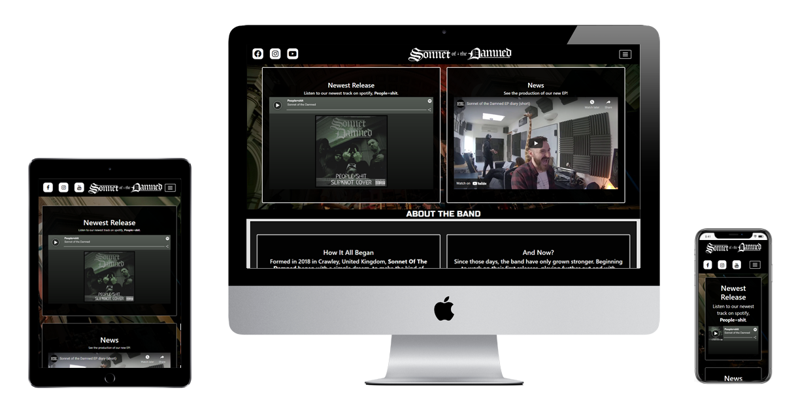

# Sonnet Of The Damned Band Website

## Project Goal
Time to change the music you listen to, time for Sonnet of the Damned. A melodic hardcore band from the south of england,
Sonnet are a fantastic band who are growing by the day. This website will give you all the info you could want or need as
a current or soon-to-be fan of the band in an easy and well defined way. The website is made individual by matching the 
bands colour schemes, providing links to their content and merchandise and giving information about their news and the band 
members.

People don't like to work to find new music so it was very important that the information was clearly divided and easy
to find about any specific subject.

Thank you for coming to look at my project and if you want to know anything about the development process feel free to
reach out to me through my github. Thanks!

---
#

## Links to Relevant Articles
* [User Experience/UX](#user-experience)
    * [User Goals](#user-goals)
    * [User Stories](#user-stories)
    * [Site Owners Goals](#site-owners-goals)
    * [User Requirements](#user-requirements)
    * [User Expectations](#user-expectations)
    * [Design](#design)
        * [Structure And Layout](#structure-and-layout)
        * [Colors](#colors)
        * [Font Choices](#font-choices)
        * [Icons](#icons)
* [Wireframes](#wireframes)
* [Features](#features)
    * [Existing Features](#existing-features)
    * [Potential Future Features](#potential-future-features)
* [Technologies Used in Development](#technologies-used-in-development)
    * [Languages](#languages)
    * [Libraries & Tools](#libraries-and-tools)
* [Testing](#testing)
* [Deployment](#deployment)
* [Credits](#credits)
* [Acknowledgements](#acknowledgements)
* [Final Thoughts](#final-thoughts)

---

## **User Experience**

### **User Goals**

The user goals for the site are...
* A website that works well on desktop, mobile and tablet.
* A website that looks good in all places.
* A website that fits with the existing band identity so a fan would want to use it.
* A website that allows easy access to the bands current social medias.
* A website that can easily direct towards merchandise for fans.
* A website that allows a user to get straight to the information they want to see without wading through information they don't want.
* A website that gives information about current tour dates.
* A website that gives up to date and relevant news about the band.
* A website that lets the user find out more about the band and its members easily.

[Back to Table of Contents](#links-to-relevant-articles)

### **User Stories**

* As a user, I want to be easily able to go to the bands social medias.
* As a user, I want to see images of the band and its members.
* As a user, I want to be able to find out whats happening with the band.
* As a user, I want to see and hear their music on the website.
* As a user, I want to be able to buy the bands merch if I like their music.
* As a user, I want to be able to find out about the history of the band.
* As a user, I want to find out when the band are playing shows near me.
* As a user, I want to be able to use the website on my phone.
* As a user, I want to have different sections of information clearly divided so I can find things.
* As a user, I want to know whether the band make music I like so I can make my decision quickly whether to stay or go.
* As a user, I want to be able to get right to the information I want without wading through info I don't care about.
* As a user, I want to be convinced that the band are exciting and good.
* As a user, I want to know that any outside link I click (i.e. social media) will open in a different tab so it doesn't interrupt my browsing experience.
* As a user, I want it to be obvious that I'm on the right website and in the right location.

[Back to Table of Contents](#links-to-relevant-articles)

### **Site Owners Goals**

* As a site owner, I want a site that makes it easy to sell merchandise and increases merch sales.
* As a site owner, I want a site that interacts well with our social medias and increases listener numbers.
* As a site owner, I want a site that makes us look better than other competing bands.
* As a site owner, I want a site that lets us easily say when we're playing shows to increase ticket sales.
* As a site owner, I want a site that talks about who we are to make people become more interested in us and attract new fans.

[Back to Table of Contents](#links-to-relevant-articles)

### **User Requirements**

* As a user, I require a site that is easy to navigate through the use of the navbar.
* As a user, I require a site that contains relevant content to the band.
* As a user, I require a site that looks good and makes sense relevant to the bands aesthetics.
* As a user, I require that nothing provides any error messages and the band info to be clear. 
* As a user, I require a site that works on mobile and tablet as well as desktop.

[Back to Table of Contents](#links-to-relevant-articles)

#### **User Expectations**

* As a user, I expect all information on bands show to tell me when and where they're performing.
* As a user, I expect any external link (like social media or merchandise) I click to open in a new tab.
* As a user, I expect an easy way to purchase merchandise.
* As a user, I expect to see what the merchandise looks like before I click on it.

[Back to Table of Contents](#links-to-relevant-articles)

### **Design**

#### Structure And Layout
I've decided to use [Bootstrap](https://getbootstrap.com/) for the overall structure and layout of my website as its
pre-included CSS and javascript elements make it much easier to keep a similar design from one page to another, has
a great mobile first layout that will adapt very well as well as my belief that I can make use of the jumbotron function 
to easily achieve the rectangle and squares based layout I designed in my wireframes.

The layout was an interesting choice, as the site was originally designed as a 5 page site, with all 5 of those pages easily
reachable via the navbar, but, due to the simplicity of the sections and the fact alot of my content was repeating itself, my
mentor adviced that I could very likely achieve a site that was more functional and far simpler by making it one page. I was
able to move the sections directly across with very little adjustment and by only removing a few repeating parts and convert
the entire thing into a one page website, with the navbar still working, but simply navigating to different headers instead of
html files. This does mean that my wireframes are somewhat outdated now, but I feel they still show the design well as the
sections - for the most part - look the same, but are simply now on one page.

[Back to Table of Contents](#links-to-relevant-articles)

#### Colors
As the band already had a logo and had made use of primarily black and white on their social medias, I decided it made
sense to stay in that general area for the rest of the website design as well. I looked at [ColorSpace](https://mycolor.space/)
and [Adobe Color Wheel](https://color.adobe.com/create/color-wheel) but just couldn't find anything I liked more than my 
original black and off-white design. 

* RGB(0,0,0): Pure and complete black. This opposes their logo (which is RGB(255,255,255)) perfectly so I decided that simple was best and stuck with it.
* RGB(223,223,223): An off-white greyish colour. I decided this was better than going with pure white like I originally planned because it makes the site less harsh
on the eyes.

It's not a very complicated design but it has great contrast, is easily readable and makes it easy to make the non-white elements of the site stand out.

[Back to Table of Contents](#links-to-relevant-articles)

#### Font Choices
For my websites fonts, I made use of [Google Fonts](https://fonts.google.com/) to find what was available to me. I didn't need 
anything for the heading as was making use of the bands logo, so wanted to find something to stand out in other places and 
eventually settled on using Russo One for the navbar, as it was adventurous, and would likely get annoying if used for whole
paragraphs, but worked perfectly for 5 large single word links and a sub-header on each page. 

As a backup for Russo One I used sans-serif as its extremely readable and very reliable, and decided to make use of that for 
the rest of the text on the website for the exact same reasons. 

[Back to Table of Contents](#links-to-relevant-articles)

#### Icons
To compliment the fonts, I decided to make use of icons for my social medias links, and realised very quickly that 
[Font Awesome](https://fontawesome.com/) would be the best way to do it. With three simple searches I was able to find the
right icons for my social medias, and were easily styled to fit in with the header bar around it and to match the band logo
next to (or above if on mobile) it. For the navbar icon I used the bootstrap default one, but made modifications to it as
bootstrap only provides an off-white and off-black one and I wanted a pure white one with a clear border to make it match
the social icons and band logo. 

[Back to Table of Contents](#links-to-relevant-articles)

--- 

## **Wireframes**
I made use of a website called [MockPlus](https://app.mockplus.com) to create the wireframes for my website. I realised
later that there were more efficient and easier tools but stuck with it as I was already half way through and it would
have been more work to switch to something else. 
I made my wireframe for the homepage's desktop version first, then did the same for the other 4 pages of the site, And
then after that made the phone and tablet versions for each. This let me focus on design in the initial stage and then
adapatation afterwards. The website was made to be quick to find what you need through the navbar and each page to be
short and sweet, with the essential information and little more. 

All 15 wireframes are viewable below:

### **Home**

#### [Desktop](https://github.com/willslater99/Sonnet-Of-The-Damned-Band-Site/blob/main/wireframes/sonnet-home-wireframe.png)

#### [Tablet](https://github.com/willslater99/Sonnet-Of-The-Damned-Band-Site/blob/main/wireframes/sonnet-home-tablet-wireframe.png)

#### [Mobile](https://github.com/willslater99/Sonnet-Of-The-Damned-Band-Site/blob/main/wireframes/sonnet-home-mobile-wireframe.png)

### **News**

#### [Desktop](https://github.com/willslater99/Sonnet-Of-The-Damned-Band-Site/blob/main/wireframes/sonnet-news-wireframe.png)

#### [Tablet](https://github.com/willslater99/Sonnet-Of-The-Damned-Band-Site/blob/main/wireframes/sonnet-news-tablet-wireframe.png)

#### [Mobile](https://github.com/willslater99/Sonnet-Of-The-Damned-Band-Site/blob/main/wireframes/sonnet-news-mobile-wireframe.png)

### **Tour**

#### [Desktop](https://github.com/willslater99/Sonnet-Of-The-Damned-Band-Site/blob/main/wireframes/sonnet-tour-wireframe.png)

#### [Tablet](https://github.com/willslater99/Sonnet-Of-The-Damned-Band-Site/blob/main/wireframes/sonnet-tour-tablet-wireframe.png)

#### [Mobile](https://github.com/willslater99/Sonnet-Of-The-Damned-Band-Site/blob/main/wireframes/sonnet-tour-mobile-wireframe.png)

### **Merch**

#### [Desktop](https://github.com/willslater99/Sonnet-Of-The-Damned-Band-Site/blob/main/wireframes/sonnet-merch-wireframe.png)

#### [Tablet](https://github.com/willslater99/Sonnet-Of-The-Damned-Band-Site/blob/main/wireframes/sonnet-merch-tablet-wireframe.png)

#### [Mobile](https://github.com/willslater99/Sonnet-Of-The-Damned-Band-Site/blob/main/wireframes/sonnet-merch-mobile-wireframe.png)

### **About**

#### [Desktop](https://github.com/willslater99/Sonnet-Of-The-Damned-Band-Site/blob/main/wireframes/sonnet-about-wireframe.png)

#### [Tablet](https://github.com/willslater99/Sonnet-Of-The-Damned-Band-Site/blob/main/wireframes/sonnet-about-tablet-wireframe.png)

#### [Mobile](https://github.com/willslater99/Sonnet-Of-The-Damned-Band-Site/blob/main/wireframes/sonnet-about-mobile-wireframe.png)

It may seem strange that I have wireframes designed for 5 different pages when my website is a single smooth
scrolling page, but this was a conscious decision during the project, realising on the recommendations of others 
that looked at the site that as its only 5 pages and each page is very small, it would make more sense to have
them as different sections of a single page. Although they don't all have an individual page anymore, its still
the exact same content, and the navbar simply scrolls you to the relevant point of the page instead of taking you
to a different one, so the site essentially functions the same.

[Back to Table of Contents](#links-to-relevant-articles)

--- 

## **Features**

### **Existing Features**

#### Navigation

For navigation I decided to go with a dropdown navbar from a hamburger icon that I used Bootstrap to implement,
choosing to have this appear no matter the platform viewed on instead of just on mobile as some might have, as I 
felt it was better to save space and clean up the visual appearance of the desktop version of the site. I stuck with
website standards on this and affixed the icon to the header bar on the top right, as it appears on many or even 
most websites.

#### Social Medias 

To better integrate with the pre-existing social medias the client has, I decided to use three matching Icons through
[Font Awesome](https://fontawesome.com/) affixed to the top left of the header bar on desktop and tablet to make it
easy for users to find the three main social medias of the client. For the mobile view I changed this a bit to give
a more appealing look, making use of a media query to hide the original icons and place a replica set of icons below
the band logo, giving a better mobile website flow overall.

#### Band Logo Header 

For the website header I choose not to use fonts and to just go directly with the clients pre-existing logo, which
I made into a clickable in-site link that returns to the site homepage no matter the platform, as this is very
standard and has almost come to be expected from modern websites. 

#### Hero Image

I implemented a hero image of the band performing and placed it below the header of the site, then covering it with
a partially transparent grey cover, to give a darker effect to the image overall and make it blend in better with the
websites darker tones as it was originally quite a bright image. I set its width to cover the entire website and its 
height to 70vh, allowing some of the next section below it to show so that someone has the opportunity to see whats
next and potentially get them interested. 

#### News/New Releases Jumbotrons

I made use of Bootstrap's jumbotron feature heavily throughout the site, and it started with two equally spaced 
jumbotrons next to each other. One of these is entitled news and shows a piece of news about the band of the clients
choice, in this case including an embedded youtube video. The other is New Release and is supposed to show the newest
thing out by the client, in this case a cover of theirs, shown through an embedded spotify song. 

#### News Columns

Again using the jumbotron feature, I have created columns that display each a different article of news about the band.
On desktop these appear as three equally spaced long columns next to each other, and on tablet and mobile instead appear
in a stacking fashion, one on top of the other. This differs from my original wireframe for tablet as my original plan 
was just to have the tablet version appear like a smaller version of the desktop, but I realised that it just would have
been too small to be functional and adapted it. 

#### Tour Dates

The website provides tour dates for the band, stating the city, venue and date they are performing. On desktop and tablet
this appears as two large boxed columns next to each other (again using jumbotrons) and on mobile instead appears as one
longer scrolling boxed column. This provides a readable view on all platforms and makes good use of the space without
being hard to look through or wasting any space.

#### Merchandise

Through the website, you can also see the bands merchandise and use a link to go to the relevant place to buy it. On 
desktop this appears as three boxes next to each other on each row and is in two rows (although it could be as many as
the client wanted, I just kept it simple to start), on tablet it displays as two boxes next to each other in three rows
and on mobile appears as each box taking up the majority of the screen width and appearing one after another in a 
scrolling fashion. This is well designed as it can be as short or long and include as many items as the client likes.

#### About The Band

On the about the band section, I've used a large jumbotron split into three columns (the first two being text and the
last being a picture of the band) as this allows the website to simply shift a third of the site onto the next row to
adapt to smaller screens without much work. On desktop they appear all next to each other, on tablet they appear as two
columns of text and a picture below it and on mobile they just look like two paragraphs and then a picture.

#### About the Band members

For the about the band members section, I've again used jumbotrons to have a jumbotron for each band member, each One
containing a picture and a paragraph of information. On desktop this appears as 4 equally sized and spaced columns next
to each other for the 4 band members, on tablet this appears in rows of two by two and on mobile it appears one below
another in a scrolling fashion, making it perfectly adapatable and easy to use. 

#### Footer

In the footer, I included a small bit of legal info stating it was developed by Will Slater and the year that was done 
so and affixed it to the center left. The most useful feature of the footer though is that it includes smaller versions
of the three social media icons found in the header, so that someone can click to these links without having to scroll
back up to the top of the page. These are affixed to the right hand corner of the footer and do and look the same as the 
top icons, but are just smaller and added purely for user convenience. 

[Back to Table of Contents](#links-to-relevant-articles)

### **Potential Future Features**

#### Payment Systems

In the future I'd like to integrate a payment system. It could have huge potential uses for the merchandise section as 
being able to sell merchandise, albums and show tickets directly from the website could do massive for sales numbers and
overall taking for the client. 

#### Contact form

A contact form could be potentially integrated so that events managers could contact them about booking them for shows and
fans could contact them with questions.

#### Sell tickets

A way to sell tickets to the events listed on the tour section could be great for upping attendance numbers. I didn't look
at this now as the band still don't have presale on alot of their shows, but it could be great as they grow.

#### Google Maps Integration

Being able to click on a specific venue name listed on the tour section and see through either an embedded popup or link 
directly to the google maps site would be great, allowing the user to see exactly where the venue is to make attendance 
easier. 

[Back to Table of Contents](#links-to-relevant-articles)

---

## **Technologies Used In Development**

### **Languages**

* [HTML](https://en.wikipedia.org/wiki/HTML): Hypertext Markup Language, or HTML, is the building blocks of the internet and so the base of all 5 webpages found on the site.
* [CSS](https://en.wikipedia.org/wiki/Cascading_Style_Sheets): Cascading Style Sheets, or CSS, allows us add design, colour and  more to the building blocks created by the HTML.
* [JavaScript](https://en.wikipedia.org/wiki/JavaScript): JavaScript is used for the more complex moving parts of a website. I haven't used any javascript first-hand but it is
                                                          used throughout the site through [Bootstrap's](https://getbootstrap.com/) classes that make use of it automatically.

### **Libraries and Tools**

* [Font Awesome](https://fontawesome.com/): Font Awesome allowed me to acquire the icons that I used for my social media links.
* [Bootstrap](https://getbootstrap.com/): Bootstrap is the primary library running the site, allowing my jumbotrons to function and my site to adapt well between tablet and mobile.
* [Google Fonts](https://fonts.google.com/): Google Fonts provided the font Russo One which I've used for my navbar and individual page headings. 

### **Tools**
* [GitHub](https://github.com/): Github is the software hosting site for the project and holds all of my work throughout.
* [GitPod](https://www.gitpod.io/): Gitpod is the programming platform I've made use of as it integrates directly with GitHub. 
* [Mockplus](https://app.mockplus.com/): Mockplus is a wireframe creation tool and is how I made the 15 wireframes I used for the design of my website.
* [W3C HTML Validation Service](https://validator.w3.org/): W3C is an online validator that checks the HTML you feed into it for any syntax errors (i.e unclosed div's, using 
                                                            obselete code, etc) and then tells you what's wrong so you can correct it.
* [W3C CSS Validation Service](https://jigsaw.w3.org/css-validator/): W3C CSS is an online validator that checks the CSS you feed into it for errors to tell you what's wrong so 
                                                                      that you can fix it.
* [Bootstrap Documentation](https://getbootstrap.com/docs/4.5/getting-started/introduction/): Bootstrap's documentation tool allows you to search for anything found in bootstrap
                                                                                              and provides you information about what it is and how it works.
* [Google Images](https://www.google.com/imghp?hl=xx-elmer): Google images is a resource for online images. I used it for the objects in the merch section and checked to make sure
                                                             all the ones I used were royalty free for use. 

[Back to Table of Contents](#links-to-relevant-articles)

---

## **Testing**

### Navigation Bar

* **Plan**    
I want to include a drop-down navigation bar which will be fixed to the top-right, in the header and next to the band logo.  
I want the nav-bar to be in a drop-down form on all devices to save space, and to appear with the links to the five site
pages aligned horizontally on desktop and tablet and instead vertically on mobile. 

* **Implementation**   
I used Bootstrap to implement the nav-bar as this helps to automatically structure it and adapt it better for different
screen sizes. I used CSS to change the colour of the navbars colours, hamburger icon and text to make it fit better with
the site.

* **Test**    
To test the navbar, I have clicked on all of the links to make sure they go to the right pages, then repeated this click
test using chrome developer tools to click them in a mobile and tablet form to make sure that nothing changes it and that
it still works. I also checked it on Edge and Firefox to see if it worked the same on other browsers, which turned out
perfectly. 

* **Result**    
The navbar shows how I want it to on all devices and browsers. It was a little close to the right hand edge on mobile so 
in my mobile media query I increased the margin to get a better result. All links work, it appears how I want it to and
I'm completely happy with it.

### Jumbotrons/Rectangular Dividers
* **Plan**    
I want to have nearly all of the site presented by seperated and aligned rectangles that each contain the bit of info
relevant to the page they're on. 

* **Implementation**    
As I'm not at the necessary skill level with JavaScript to do this in a reasonable time frame, I used Bootstrap's 
jumbotrons to do this as they fit into bootstrap's column system for multi-device implementation nicely and can be 
adjusted very easily. For the most part they fit in well, aligning how I want them to and adapting to different devices
how I predicted and wanted them to. On the occasion that they don't adapt to a device properly, I made use of advice
from a tutor of creating a duplicate set of jumbotrons layed out exactly how I wanted them and then just making use
of CSS to hide this duplicate set when the original ones work and making it appear when I need it to and then hiding
the original. I have all the content within them centered, to make them align well. I also have them all slightly 
transparent through the use of RGBA in CSS so that any hero images and background colours aren't completely covered.  

* **Test**    
I've tested them on multiple devices, screen sizes and browsers and have achieved the intended result on all. Looking 
at them on all pages to make sure they do as intended. No errors found. 

* **Result**    
The jumbotrons appear as intended, look good and provide the isolated information inside them nicely and visibly. I'm
completely happy with my result.

### Social Media Links
* **Plan**    
I want to include three icons to link directly to the clients various social medias. These should appear as in the
top left, inside the header and be aligned with the band logo header text and navbar icon. 

* **Implementation**    
To implement this, I made use of FontAwesome to get the three right icons for my three links. I made an unordered list
with the links to each social media being the three items in the list, then used CSS to stylise the whole thing, making
them appear as 3 squares with the icon in the center, then setting their background color to white and the icon to black,
rounding the corners on them to make them look better and then finally setting for the background and icon color to reverse
when hovered over on desktop. Finally, as I wanted them to appear below the band logo on mobile, I made use of the trick I 
had been taught of duplicating and hiding it, so created a copy of the icons and then placed the come for it after the band
logo and before the navbar, allowing them to appear below the logo but to the left of the navbar on mobile. Then I simply 
hid it on desktop and tablet views and made it appear on mobile, hiding the original one for mobile view to avoid having 
two visible copies. Finally, I duplicated this code and added it onto the bottom of the footer, then gave it a different ID 
and used CSS to change its size and hide it on mobile view, as I realised this would appear better.

* **Test**    
I tested these links by clicking on all three of them on all 5 pages (15 times), then repeating that on tablet and mobile
(45 times) and finally doing the same thing on Edge and Firefox (resulting in me clicking the same three links 135 times).
I viewed them on all platforms to make sure they looked how I wanted them to.

* **Result**    
After all the testing the links came out perfect, the icons look how I want them to and I'm completely happy with the
result that I've achieved. 

[Back to Table of Contents](#links-to-relevant-articles)

---

## **Bug Fixing**

#### Homepage About Text

* **Bug**    
The text wasn't centering no matter what I did, and it looked very bad as it was sticking to the left-hand side of the screen.

* **Fix**        
I realised that everything else was wrapped in a div but that this wasn't, so put the paragraph inside of its own div. This 
worked and where-ever I placed the div the text would center within it when asked, so I just centered the text within the div
then centered the div within its parent element.

* **Verdict**    
Bug was fixed and it now appears as intended. 

#### Dropdown Navbar

* **Bug**    
The navbar hamburger icon was appearing, but not doing anything on merch.html but no other page. 

* **Fix**    
Tried alot of fixes but couldn't figure out what was wrong. I then while looking through my other pages where the navbar 
was working for inspiration noticed that the button elements data-target was pointing to navbarmenu, the correct ID for 
what I was aiming for, but the rest of the pages were specifically stating #navbarmenu. I added the # symbol and it began
working immediately. 

* **Verdict**    
Bug was fixed and the navbar now works in all places. 

#### Jumbotrons

* **Bug**    
On some pages, jumbotrons were going over the side of the screen on mobile and overlapping instead of appearing one
below another.

* **Fix**
I took alot of time trying to solve this and couldn't figure out why I was having problems as Bootstrap is made to 
automatically push elements that don't fit down onto the next row below it. I tried playing with margins, centering,
the number of columns assigned to it in Bootstrap's pre-included classes, but with no result. I then attempted to
change the size of the jumbotrons to make them smaller and see if this helped by switching 'col-md-6' to 'col-sm-6', 
and when I did so, the items were so small that they weren't practical. I then decided to see what would happen if
I increased their designated size and used 'col-xl-6' and this immediately fixed the problem, making them no larger 
than they were as 'col-md-6' but stacking how they should on smaller devices. My best theory as to why this happened
is that Bootstrap thought because the elements had classes stating them as medium, it could fit them next to each 
other even on the smaller screensize, but that once I changed this to state they were extra large, it knew that it
had no chance of fitting it and pushed the second item down to the row below, although I don't understand the tech
enough so this is a guess at best. 

* **Result**   
Bug was fixed and the jumbotrons all resize as intended now. 

#### Galaxy Fold Appearance

* **Bug**    
The site resizes well for convential devices I tested (pixel 2a, iphone X, Ipad, Ipad Pro, etc) but when I tested
it on a Galaxy Fold as presented by Chrome developer tools, it took a completely different form and huge parts of
the site break including multiple sections, the header and the footer. 

* **Fix**    
The reason for the issue is obvious to me. The device has very odd dimensions compared to convential devices, being 
only 280 pixels wide in its 'phone-form'. Because of this, huge amounts of things are being pushed down to the next
row that should appear next to each other and items are appearing too large and covering others. To fix this, I
would need to either create a new media query specifically for this device or go back through and change every
single size value to work in vw or vh, which would be a long process as alot of my device uses pixel values that
change based on media query. 

* **Result**
The bug has not been fixed and I will do so in the next release. I will also try to refrain from pixel values and
make better use of vw/vh values instead in the future on all projects. 

#### Social Icons

* **Bug**    
When viewed on desktop the icons weren't appearing on desktop or tablet but were on mobile.

* **Fix**        
I looked through the css for the classes and ID's attached to the social icons and their links and quickly found
that, as I have duplicate versions of the social icons for different placement on different devices, I had
accidentally set the ID's for them both as 'display: none;' on the main css but had entered them correctly as
'display: none;' and 'display: inline;' on the mobile media query. I corrected the issue and made the original
copies of the icons show, fixing the issue. 

* **Result**    
The issue was fixed and now appears as intended on all primary devices. I'm happy with the result.

[Back to Table of Contents](#links-to-relevant-articles)

##### Image and Text sizes

* **Bug**
A big problem I had with the site at first was that it wasn't adapting well to different sizes, and I was having
to rewrite nearly all my css in media queries to adjust for tablet and phone layouts (and even these weren't very
reliable).

* **Fix**
I spoke with my mentor about this and was advised that my use of pixel values everywhere was a big part of it, so 
I temporarily commented out my media queries, went through my CSS piece by piece and replaced every single pixel
value with a vw, vh or em value instead.

* **Result*
The site now adjusts brilliantly to different sizes as alot of my pixel values were also just fighting Bootstrap's 
default implementation. The result is that it looks brilliant and I was able to massively shrink down and optimise
my CSS, taking it from nearly 800 lines of code to less than 300. 

---

## **Deployment**

This project was deployed using GitHub by following the steps given below, which must be done after the code
has been written, committed and pushed to GitHub.

1. Log into your GitHub account. 
2. Enter the repository and then go to the **Settings** tab.
3. Scroll down to the 'GitHub pages' section and then the 'Source' piece within it.
4. Select 'Branch: Main' from the dropdown menu and then select the folder of 'Root'.
5. Click 'Save' and then wait a couple minutes and it should be up and working.
6. Now its completely viewable at https://willslater99.github.io/Sonnet-Of-The-Damned-Band-Site/ and any and all commit's and pushes from relevant IDE's (such as GitPod) 
will automatically update it.

If you want to run the project locally:

1. Log into your GitHub account.
2. Click the 'Code' dropdown and then within it, select the HTTPS option and copy the link displayed.
3. Open your IDE and open the Git Terminal. 
4. Set your working directory to the intended directory for the cloned repository.
5. Use the 'git clone' command and paste in the URL copied from before. 
6. Enter and it will create your clone repository. 

[Back to Table of Contents](#links-to-relevant-articles)

---

## **Credits**

I've used two sites for the primary inspiration on how I would build my site. Both rock-band sites for helping align with the standards. 

[Nickelback](https://www.nickelback.com/)

[Evanesence](https://www.evanescence.com/home/)

All of my pictures for the website were taken from the clients social medias except for the merchandise page, where I used [Google Images](https://www.google.com/imghp?hl=xx-elmer)
and looked for royalty free images to use, as these are only made to be temporary fill-ins before they can be replaced with genuine merchandise photos for the band.

[Back to Table of Contents](#links-to-relevant-articles)

---

### Acknowledgements

I'd like to thank my mentor Simen ([Eventyret_mentor](https://github.com/Eventyret)) for helping me with a 
huge amount of the project and really pushing me in the right direction. He really helped with getting back
on track when I wasn't exactly sure how to proceed as well as helping me understand the standards necessary
for the project so I could know what should and shouldn't be done. Finally he was humongously helpful on
advising me how to structure my readme.

I also give thanks to the Code Institute tutors for really helping on a few occasions when I got lost in an
error or piece of code and they were able to advise me back on track. 

Alot of my inspiration comes from years performing in touring metal bands myself, so knowing what a typical
band would want from the site as well as well as being a fan of metal, knowing what a user would want too. 
My inspiration I got mostly from runnning a bed & breakfast myself in Portugal a couple of years ago. 

[Back to Table of Contents](#links-to-relevant-articles)

---

### Final Thoughts 

Although there are things I could have done better with the site and in a future update I would improve upon,
I feel I have exceeded the minimum acceptable version and produced a well presented and functional website 
that serves its purpose well, as well as teaching me alot about what to do for future instances. 

[Back to Table of Contents](#links-to-relevant-articles)

---
